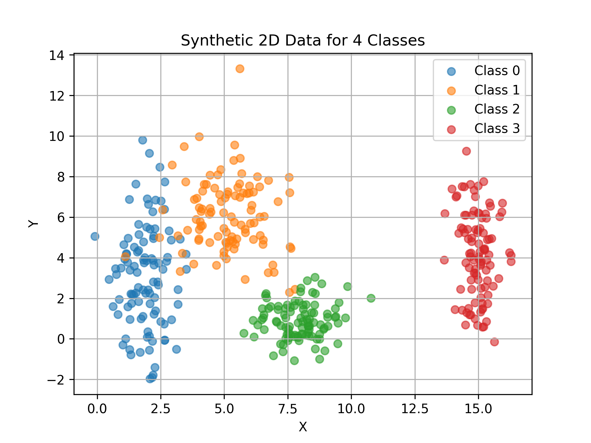
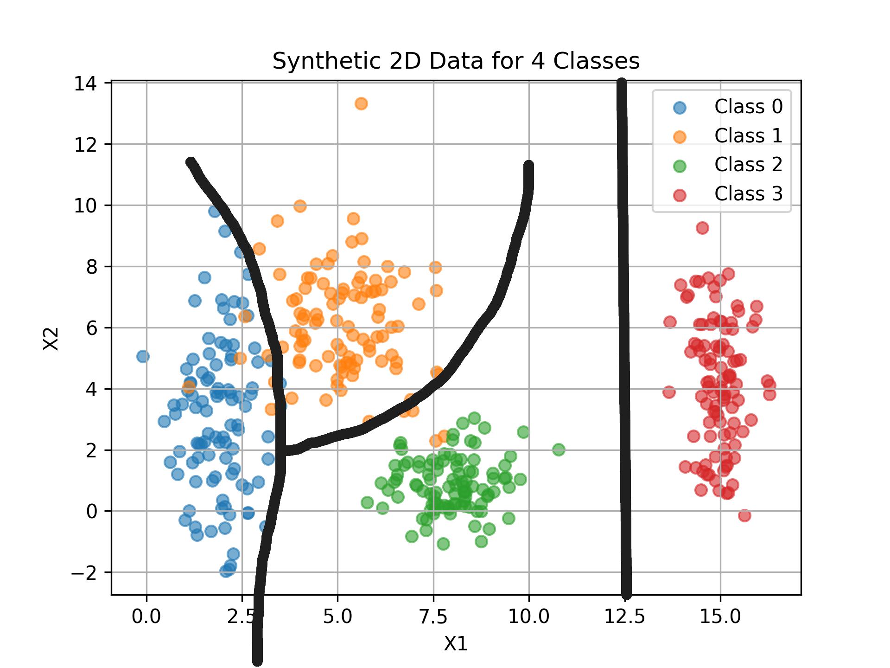
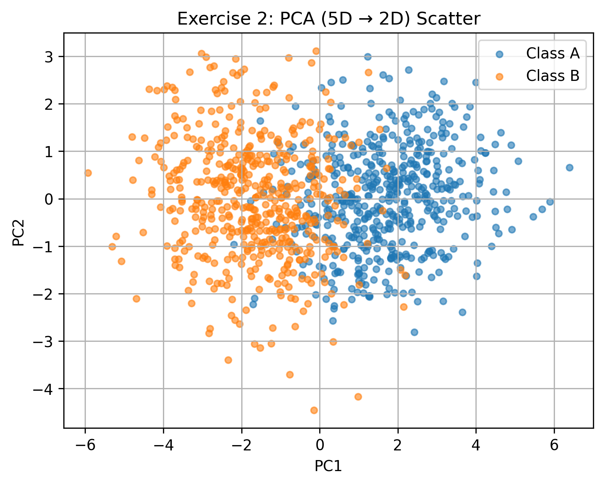
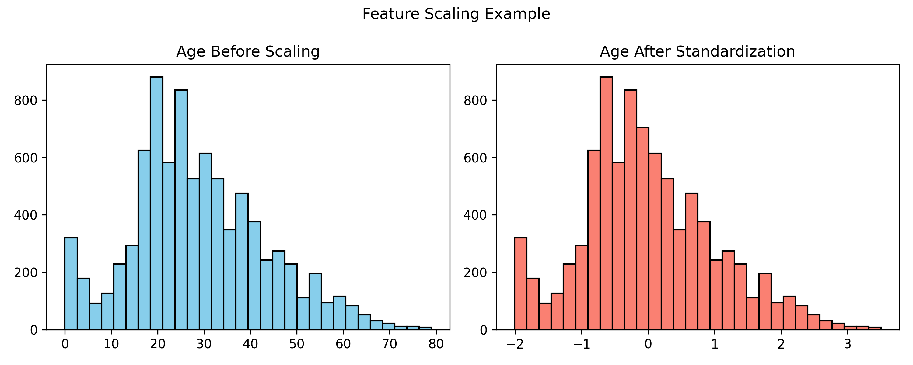
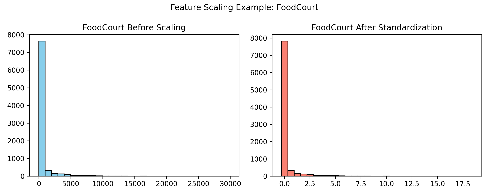

# Exercise 1 – Exploring Class Separability in 2D

## 1. Data Generation

Generated a synthetic dataset with 400 samples (100 per class) using Gaussian distributions defined by the given means and standard deviations:

- **Class 0:** Mean = [2, 3], Std = [0.8, 2.5]  
- **Class 1:** Mean = [5, 6], Std = [1.2, 1.9]  
- **Class 2:** Mean = [8, 1], Std = [0.9, 0.9]  
- **Class 3:** Mean = [15, 4], Std = [0.5, 2.0]

## 2. Visulization: Scatter Plot

## 3. Analysis and Decision Boundaries

### a. Distribution and Overlap
- **Class 0** is spread vertically due to a large standard deviation in the y-axis.  
- **Class 1** clusters around (5,6), moderately spread.  
- **Class 2** lies near the bottom-center region, concentrated.
- **Class 3** is far apart on the right side, with significant vertical spread.  
- There is some overlap between Classes 0 and 1, and between Classes 1 and 2.  
- Class 3 is clearly separable from the others due to its distance.

### b. Linear Separability
A single global **linear boundary cannot perfectly separate all classes**, because Classes 0, 1, and 2 overlap. However, piecewise linear or nonlinear decision boundaries could achieve good separation.

### c. Decision Boundaries
A neural network would likely:
- Draw **nonlinear curved boundaries** between Classes 0, 1 and 2.  
- Use a **clear vertical cut** to separate Class 3 from the others.

As such, a trained model would need at least moderately complex decision boundaries to classify all four classes correctly. In terms of visual separation, without overfitting the model, it would be similar to this:

# Exercise 2 – Non-Linearity in Higher Dimensions

## 1. Data Generation (5D)

Generated 1,000 samples using multivariate normal distributions (500 per class).

- **Class A** — mean **μ_A = [0, 0, 0, 0, 0]**, covariance **Σ_A**:

**Covariance matrix for Class A:**

|      | x₁   | x₂   | x₃   | x₄   | x₅   |
|------|------|------|------|------|------|
| x₁   | 1.0  | 0.8  | 0.1  | 0.0  | 0.0  |
| x₂   | 0.8  | 1.0  | 0.3  | 0.0  | 0.0  |
| x₃   | 0.1  | 0.3  | 1.0  | 0.5  | 0.0  |
| x₄   | 0.0  | 0.0  | 0.5  | 1.0  | 0.2  |
| x₅   | 0.0  | 0.0  | 0.0  | 0.2  | 1.0  |

- **Class B** — mean **μ_B = [1.5, 1.5, 1.5, 1.5, 1.5]**, covariance **Σ_B**:

**Covariance matrix for Class B:**

|      | x₁   | x₂    | x₃   | x₄   | x₅   |
|------|------|-------|------|------|------|
| x₁   | 1.5  | -0.7  | 0.2  | 0.0  | 0.0  |
| x₂   | -0.7 | 1.5   | 0.4 | 0.0  | 0.0  |
| x₃   | 0.2  | 0.4  | 1.5  | 0.6  | 0.0  |
| x₄   | 0.0  | 0.0   | 0.6  | 1.5  | 0.3  |
| x₅   | 0.0  | 0.0   | 0.0  | 0.3  | 1.5  |

## 2. Dimensionality Reduction & Visualization

Applied **PCA** (5D → 2D) resulting in the following distribution:

## 3. Analysis

### a. Relationship between classes.  
In the 2D PCA view, the classes form two clusters with **partial overlap**. Class **B** tends to shift along **PC1** because of its higher mean vector, while both classes spread along **PC2** due to similar variance/correlation patterns in their covariances.

### b. Linear separability.
The data are **not cleanly linearly separable**. Different covariance structures (including opposite-signed correlations) plus only a moderate mean shift cause interleaving along some directions. PCA is **unsupervised**, so it may mix class information in the top components, increasing overlap in 2D. A single linear boundary (e.g., a Perceptron) will struggle; a **multi-layer neural network with non-linear activations** (or kernel methods) can learn **curved boundaries** in the original 5D space that better align with the geometry and separate the classes more accurately.

# Exercise 3 – Preparing Real-World Data for a Neural Network

## 1. Dataset Objective
The dataset comes from the **Kaggle Spaceship Titanic** competition.  
- The target column is **`Transported`**, which indicates whether a passenger was transported to an alternate dimension after the spaceship accident.  
- This is a **binary classification** task.

## 2. Dataset Overview

| Numerical Features      | Categorical Features      |
|------------------------|--------------------------|
| Age                    | HomePlanet               |
| RoomService            | CryoSleep                |
| FoodCourt              | Cabin                    |
| ShoppingMall           | Destination              |
| Spa                    | VIP                      |
| VRDeck                 |                          |

### Target Feature
- `Transported` (True/False)

### Missing Values
- **All** categories have missing values except for the `target` feature, around 200 occurences per feature with slightly less in most of them.

## 3. Preprocessing Steps

### a. Handling Missing Data
- For **numerical features**, missing values are imputed with the **median**, which is robust to skewed spending distributions.  
- For **categorical features**, missing values are imputed with the **mode** (most frequent category).  
- This ensures no rows are dropped unnecessarily and that the replaced data is closer to the "reality" within the sample.

### b. Encoding Categorical Features
- **One-hot encoding** is applied to categorical features (`HomePlanet`, `CryoSleep`, `Destination`, `VIP`).  
- This avoids ordinal assumptions and allows the network to learn separate weights per category.

### c. Scaling Numerical Features
- Numerical columns are standardized to **mean = 0, std = 1**.  
- This is preferred since the neural network uses a **tanh activation function**:
  - `tanh` outputs values in **[-1, 1]**.  
  - Centering inputs at zero with standardization accelerates convergence and stabilizes learning.

## 4. Visualization of Transformations

### **histograms of `Age`** and **`FoodCourt`** before and after scaling.  

- Results:
  - Before scaling: raw distributions with arbitrary ranges (e.g., Age in years, FoodCourt in credits).  
  - After scaling: centered around 0, standardized variance, which matches the activation range of **tanh**.  
  - Almost if not identical data distribution.

## 5. Conclusion
The dataset has been cleaned, encoded, and standardized so it is **ready to be fed into a neural network** using `tanh` activation.  
This preprocessing ensures:
- Missing data does not harm training.  
- Categorical variables are machine-readable.  
- Input scale matches the requirements of the chosen activation function.
