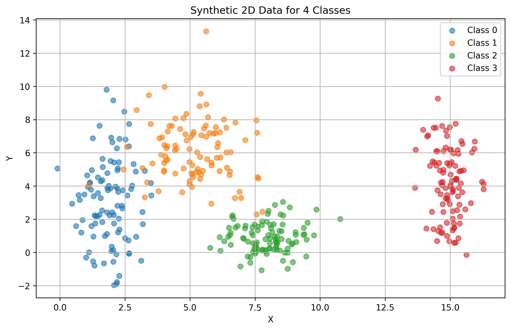

# Study 1 – Exploring Class Separability in 2D

## 1. Data Generation

Generated a synthetic dataset with 400 samples (100 per class) using Gaussian distributions defined by the given means and standard deviations:

- **Class 0:** Mean = [2, 3], Std = [0.8, 2.5]  

- **Class 1:** Mean = [5, 6], Std = [1.2, 1.9]  

- **Class 2:** Mean = [8, 1], Std = [0.9, 0.9]  

- **Class 3:** Mean = [15, 4], Std = [0.5, 2.0]  

## 2. Visualization: Scatter Plot

## 3. Analysis and Decision Boundaries

### a. Distribution and Overlap
- **Class 0** is spread vertically due to a large standard deviation in the y-axis.  
- **Class 1** clusters around (5,6), moderately spread.  
- **Class 2** lies near the bottom-center region, concentrated.
- **Class 3** is far apart on the right side, with significant vertical spread.  
- There is some overlap between Classes 0 and 1, and between Classes 1 and 2.  
- Class 3 is clearly separable from the others due to its distance.

### b. Linear Separability
A single global **linear boundary cannot perfectly separate all classes**, because Classes 0, 1, and 2 overlap. However, piecewise linear or nonlinear decision boundaries could achieve good separation.

### c. Decision Boundaries
A neural network would likely:
- Draw **nonlinear curved boundaries** between Classes 0, 1 and 2.  
- Use a **clear vertical cut** to separate Class 3 from the others.

As such, a trained model would need at least moderately complex decision boundaries to classify all four classes correctly.