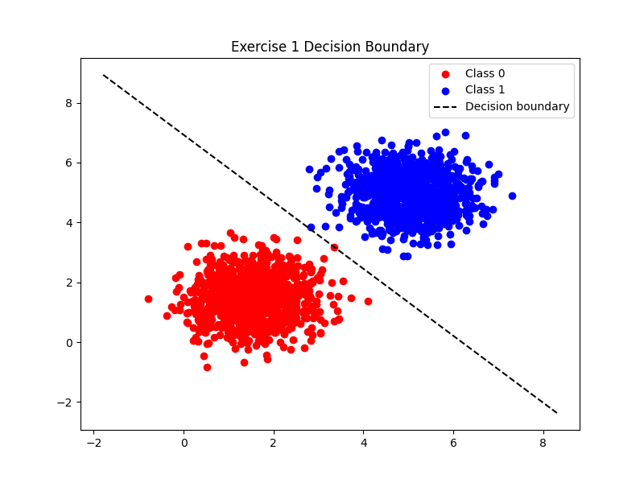
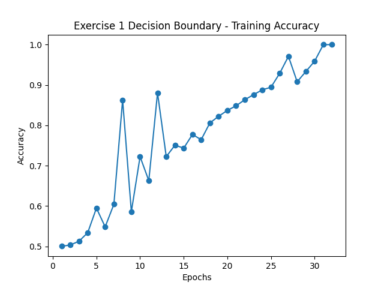
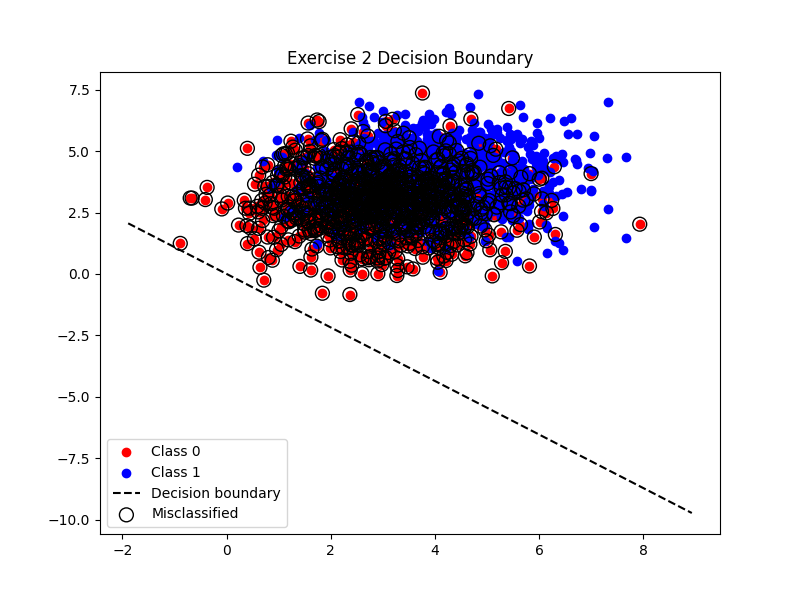
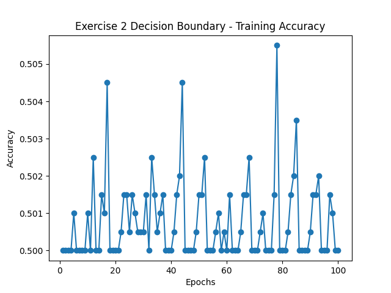

# Exercise 1 Report

**Final Weights:** [0.05653587 0.05052735]  
**Final Bias:** -0.3500  
**Final Accuracy:** 100.00%  
**Epochs until convergence:** 32

### Analysis
The perceptron converged quickly because the data is linearly separable. Clusters are compact and far apart, so the decision boundary is learned in few epochs.

  

# Exercise 2 Report

**Final Weights:** [0.03380587 0.03102548]  
**Final Bias:** 0.0000  
**Final Accuracy:** 50.00%  
**Epochs until convergence:** 100

### Analysis
Here, the means are closer and the variance is higher, causing overlap between classes. This prevents perfect linear separation, so the perceptron may not converge to 100% accuracy. Training may oscillate or plateau, highlighting the model's limitation with non-separable data.

  
