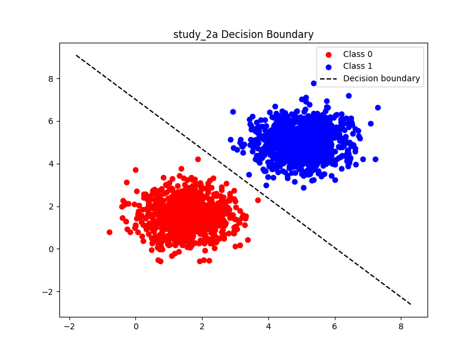
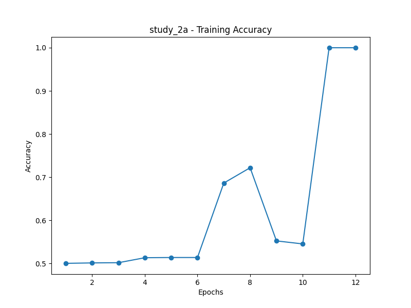
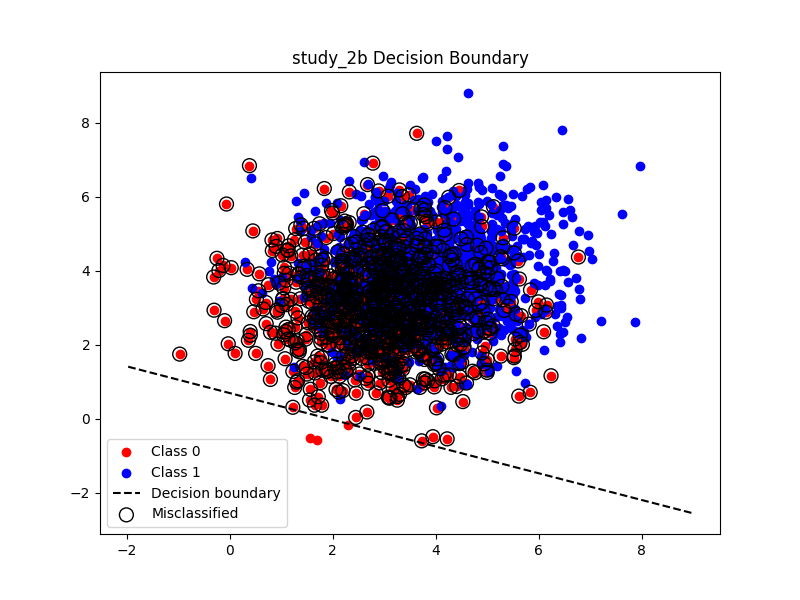
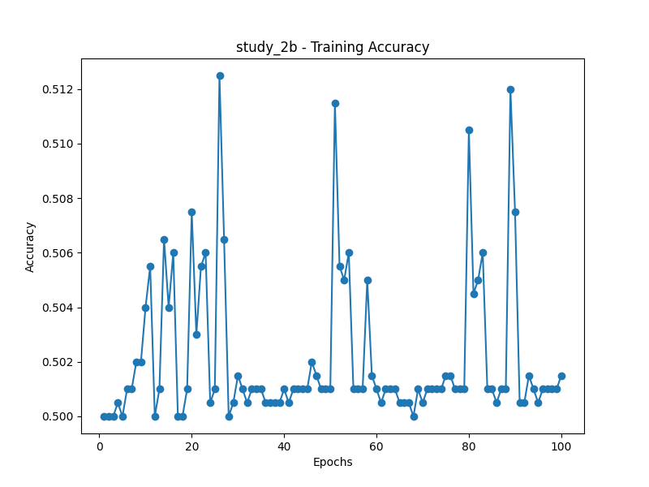

# Study 2A - Linear Separability Analysis

**Final Weights:** [0.01985622, 0.01711828]  
**Final Bias:** -0.1200  
**Final Accuracy:** 100.00%  
**Epochs until convergence:** 12

### Analysis
The perceptron converged quickly because the data is linearly separable. Clusters are compact and far apart, so the decision boundary is learned in few epochs.

  

---

# Study 2B - Non-Linear Separability Challenge

**Final Weights:** [0.01568527, 0.04336965]  
**Final Bias:** -0.0300  
**Final Accuracy:** 50.15%  
**Epochs until convergence:** 100

### Analysis
Here, the means are closer and the variance is higher, causing overlap between classes. This prevents perfect linear separation, so the perceptron may not converge to 100% accuracy. Training may oscillate or plateau, highlighting the model's limitation with non-separable data.

  
