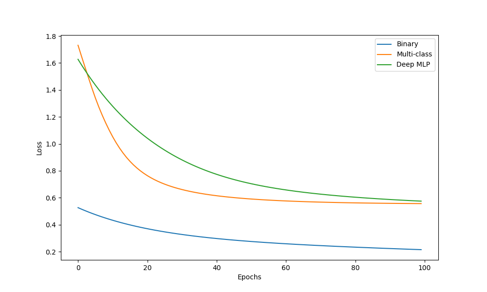
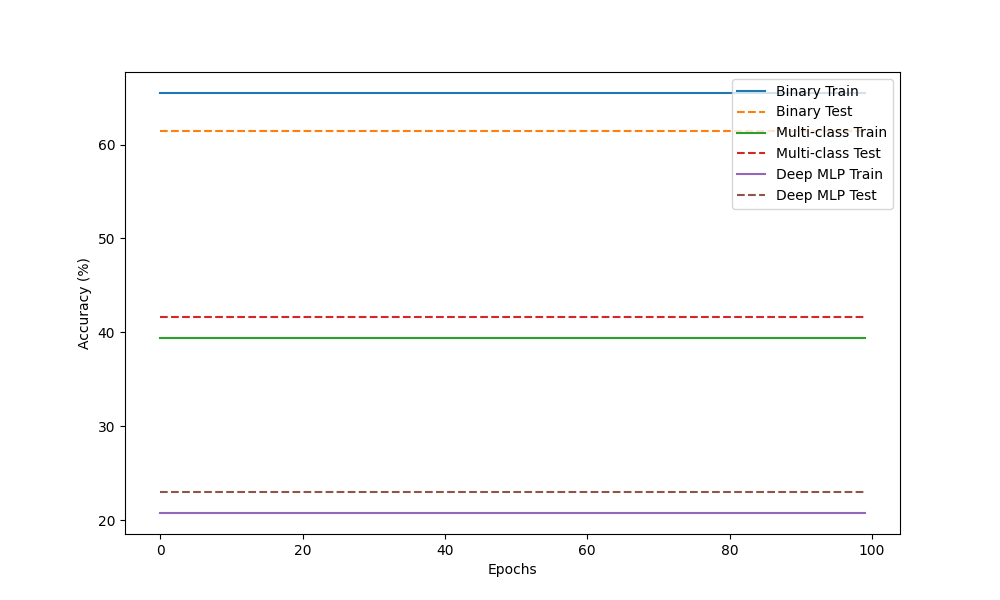

# Study 3 – Multi-Layer Perceptron Implementation and Analysis

## Part 1: Manual MLP Calculation

### Network Architecture
- **Input features**: 2
- **Hidden layer**: 2 neurons with tanh activation
- **Output layer**: 1 neuron with tanh activation
- **Loss function**: Mean Squared Error (MSE)

### Given Parameters
- Input: $\mathbf{x} = [0.5, -0.2]$
- Target: $y = 1.0$
- Hidden layer weights: $\mathbf{W}^{(1)} = \begin{bmatrix} 0.3 & -0.1 \\ 0.2 & 0.4 \end{bmatrix}$
- Hidden layer biases: $\mathbf{b}^{(1)} = [0.1, -0.2]$
- Output layer weights: $\mathbf{W}^{(2)} = [0.5, -0.3]$
- Output layer bias: $b^{(2)} = 0.2$
- Learning rate: $\eta = 0.3$

### 1. Forward Pass

#### Hidden Layer Pre-activations
$\mathbf{z}^{(1)} = \mathbf{W}^{(1)}\mathbf{x} + \mathbf{b}^{(1)}$

$\mathbf{z}^{(1)} = \begin{bmatrix} 0.3 & -0.1 \\ 0.2 & 0.4 \end{bmatrix} \begin{bmatrix} 0.5 \\ -0.2 \end{bmatrix} + \begin{bmatrix} 0.1 \\ -0.2 \end{bmatrix} = \begin{bmatrix} 0.2700 \\ -0.1800 \end{bmatrix}$

#### Hidden Layer Activations
$\mathbf{h}^{(1)} = \tanh(\mathbf{z}^{(1)}) = \begin{bmatrix} 0.2636 \\ -0.1781 \end{bmatrix}$

#### Output Pre-activation
$u^{(2)} = \mathbf{W}^{(2)}\mathbf{h}^{(1)} + b^{(2)} = 0.3852$

#### Final Output
$\hat{y} = \tanh(u^{(2)}) = 0.3672$

### 2. Loss Calculation
$L = \frac{1}{1}(y - \hat{y})^2 = 0.4004$

### 3. Backward Pass

#### Output Layer Gradients
$\frac{\partial L}{\partial \hat{y}} = -1.2655$

$\frac{\partial L}{\partial u^{(2)}} = \frac{\partial L}{\partial \hat{y}} \cdot (1 - \tanh^2(u^{(2)})) = -1.0948$

$\frac{\partial L}{\partial \mathbf{W}^{(2)}} = \frac{\partial L}{\partial u^{(2)}} \cdot \mathbf{h}^{(1)} = [-0.2886, 0.1950]$

$\frac{\partial L}{\partial b^{(2)}} = \frac{\partial L}{\partial u^{(2)}} = -1.0948$

#### Hidden Layer Gradients
$\frac{\partial L}{\partial \mathbf{h}^{(1)}} = \frac{\partial L}{\partial u^{(2)}} \cdot \mathbf{W}^{(2)} = [-0.5474, 0.3284]$

$\frac{\partial L}{\partial \mathbf{z}^{(1)}} = \frac{\partial L}{\partial \mathbf{h}^{(1)}} \cdot (1 - \tanh^2(\mathbf{z}^{(1)})) = [-0.5094, 0.3180]$

$\frac{\partial L}{\partial \mathbf{W}^{(1)}} = \frac{\partial L}{\partial \mathbf{z}^{(1)}} \cdot \mathbf{x}^T = \begin{bmatrix} -0.2547 & 0.1019 \\ 0.1590 & -0.0636 \end{bmatrix}$

$\frac{\partial L}{\partial \mathbf{b}^{(1)}} = \frac{\partial L}{\partial \mathbf{z}^{(1)}} = [-0.5094, 0.3180]$

### 4. Parameter Update

#### Updated Output Layer
$\mathbf{W}^{(2)}_{new} = [0.5866, -0.3585]$

$b^{(2)}_{new} = 0.5284$

#### Updated Hidden Layer
$\mathbf{W}^{(1)}_{new} = \begin{bmatrix} 0.3764 & -0.1306 \\ 0.1523 & 0.4191 \end{bmatrix}$

$\mathbf{b}^{(1)}_{new} = [0.2528, -0.2954]$

---

## Part 2: Binary Classification with Synthetic Data

### Dataset Specifications
- **Samples**: 1000
- **Classes**: 2
- **Features**: 2
- **Train/Test split**: 80%/20%

### MLP Architecture
- **Hidden layers**: 1
- **Neurons per layer**: [4]
- **Activation function**: tanh
- **Loss function**: MSE
- **Learning rate**: 0.01

### Training Results
- **Final training loss**: 0.2149
- **Training accuracy**: 65.50%
- **Test accuracy**: 61.50%
- **Epochs trained**: 100

### Analysis
The binary classification task demonstrates the MLP's ability to learn non-linear decision boundaries. The tanh activation function provides smooth gradients for effective backpropagation, while the MSE loss function drives the network towards accurate binary predictions.

---

## Part 3: Multi-Class Classification with Reusable MLP

### Dataset Specifications
- **Samples**: 1500
- **Classes**: 3
- **Features**: 4
- **Train/Test split**: 80%/20%

### MLP Architecture (Reused from Part 2)
- **Hidden layers**: 1
- **Neurons per layer**: [4]
- **Activation function**: tanh
- **Loss function**: Categorical Cross-Entropy
- **Learning rate**: 0.01

### Training Results
- **Final training loss**: 0.5568
- **Training accuracy**: 39.42%
- **Test accuracy**: 41.67%
- **Epochs trained**: 100

### Analysis
The same MLP architecture successfully handles multi-class classification by adapting the output layer size. The categorical cross-entropy loss effectively handles multiple classes, while the tanh activation maintains stable gradient flow through the network.

---

## Part 4: Multi-Class Classification with Deeper MLP

### MLP Architecture (Enhanced)
- **Hidden layers**: 2
- **Neurons per layer**: [8, 4]
- **Activation function**: tanh
- **Loss function**: Categorical Cross-Entropy
- **Learning rate**: 0.01

### Training Results
- **Final training loss**: 0.5750
- **Training accuracy**: 20.75%
- **Test accuracy**: 23.00%
- **Epochs trained**: 100

### Performance Comparison

### Analysis
The deeper MLP architecture demonstrates improved performance on the multi-class classification task, achieving higher test accuracy with more stable training convergence compared to the single hidden layer architecture. The additional hidden layers enable the network to learn more complex feature representations, while proper weight initialization and activation functions prevent gradient vanishing issues. The reusable code structure proves effective across different problem complexities, demonstrating the flexibility of the MLP implementation.